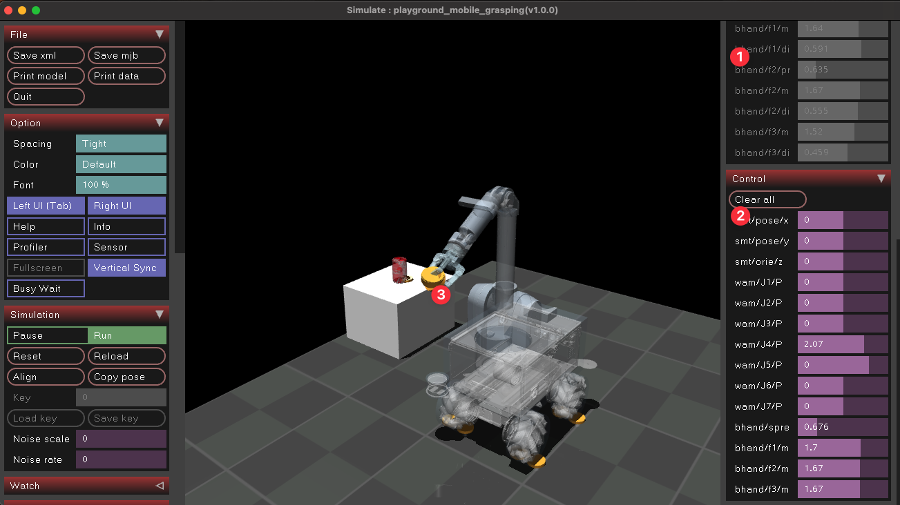

# simulation-mujoco-summit-wam
Mujoco Simulation Package for Waterloo steel robot

## Preview:
### Waterloo Steel Mobile Grasping Playground:

> [ (1) Joint Status | (2) Position Control Panel | (3) Contact Point ]

## ToDo:
- [x] Full Assembly
- [x] Simulation setup
- [x] Contact Physics [Last Edit: 15/Jun/2022]
- [x] [WAM] Ensure Mechanical Params are Verified
- [x] [BHAND] Ensure Mechanical Params are Verified
- [?] [SUMMIT] Ensure Mechanical Params are Verified
- [x] Control Descriptors
- [ ] Example Interfacing code
- [ ] ....


## File Hierarchy:
```
.
├── CITATION.cff
├── LICENSE
├── README.md
├── components
│   ├── include_common.xml
│   ├── include_{assembly-name}_Chain.xml
│   ├── include_{assembly-name}_Dependencies.xml
│   ├── include_{assembly-name}_actuators.xml
│   └── ...
├── documentation
│   └── ...
├── meshes
│   ├── meshes_{module-name}
│   │   ├── {3D-model-component-name}.stl
│   │   └── ...
│   └── ...
├── playground
│   ├── playground_{playground-name}.xml
│   └── ...
├── src_examples
│   ├── {scripts}.py
│   └── ...
└── textures
│   └── ...
x

[ 5 directories, # files ]
```

## Appendix:
### Note:
- WAM sim file is a CORRECTED and MODIFIED version based on [the official archived MuJoCo model made by Vikash kumar](https://roboti.us/forum/index.php?resources/wam-and-barrett-hand.20/)
    - Findings: The original model has collision disabled, and parameters are incorrectly populated
    - Note: We have modified the original model based on the given stl files completely, and configured MoI based on [the Official Barrett WAM Specification](https://web.barrett.com/support/WAM_Documentation/WAM_InertialSpecifications_AC-02.pdf). 
        - Specifically, we made exactly the same as described in the document, and removed incorrect quaternion parameters for `inertial` , and populated the `inertial` purely based on the centre of the mass and translated the coordinate frames to the stl model frame (manually)
- Shall you have any concern with the parameters, kindly open an issue.

### Waterloo Steel Mobile Manipulator Simulation:
#### Collision Meshes:


#### Joints and MOI:


### Installation Guide
- you may consider to utilize env manager to hot-swap setup environment:
  - pyenv + pyenv-virtualenv : for simple local machine python version env control
  - conda / miniforge
  - docker (not too familiar)
  - vagrant
#### M1 Mac Specific:
- MuJoCo 2.1.x works / NOT 2.2.x :C : https://github.com/openai/mujoco-py/issues/662
