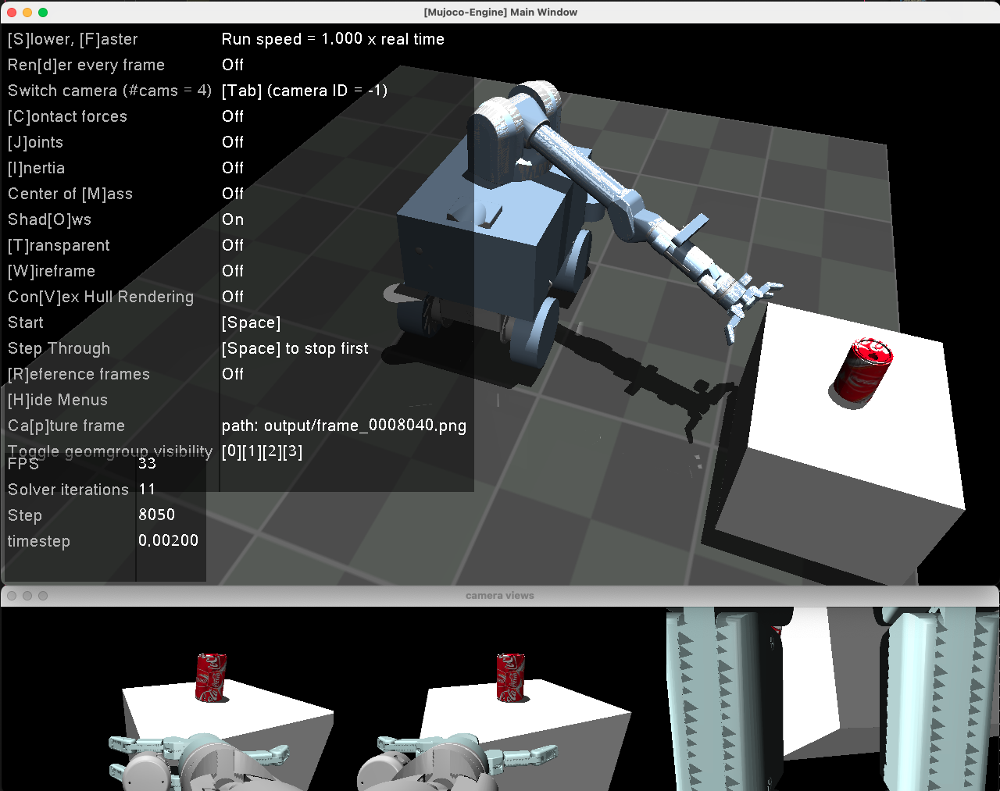
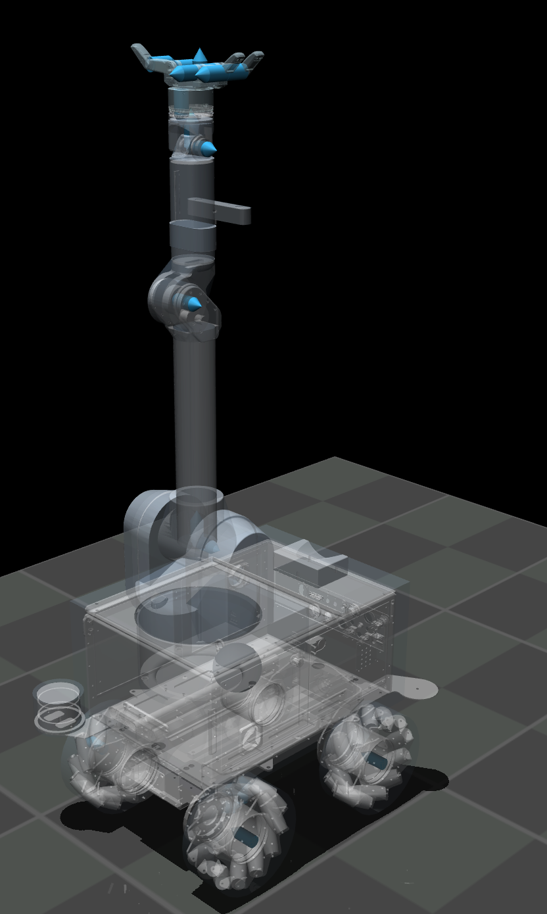
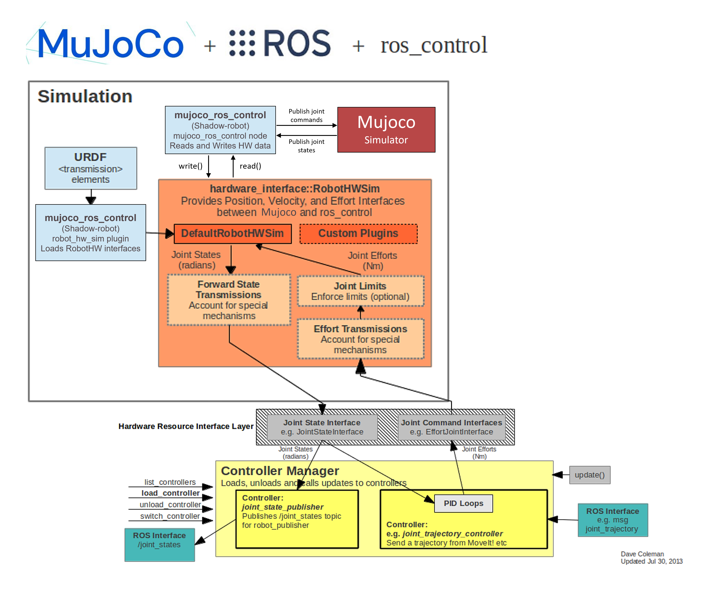
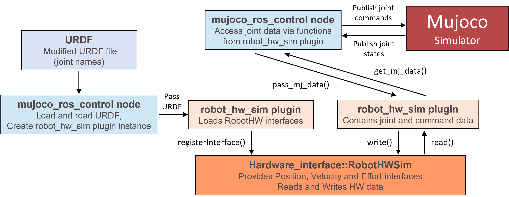

<toc>

# Table of Contents
[*Last generated: Thu 07 Dec 2023 02:38:20 PM EST*]
- [**Mujoco Simulation Packages**](#Mujoco-Simulation-Packages)
  - [1. Preview:](#1-Preview)
    - [1.1 Custom Library to support with MuJoCo 2.2.x](#11-Custom-Library-to-support-with-MuJoCo-22x)
    - [1.2 Waterloo Steel Mobile Playground (engine & viewer):](#12-Waterloo-Steel-Mobile-Playground-engine-viewer)
  - [2. ToDo:](#2-ToDo)
  - [3. Note:](#3-Note)
  - [4. Installation](#4-Installation)
  - [5. Launch:](#5-Launch)
    - [5.1 Cart Manipulation:](#51-Cart-Manipulation)
      - [Variables of simulation:](#Variables-of-simulation)
    - [5.2 Environment model location:](#52-Environment-model-location)
  - [6. File Hierarchy:](#6-File-Hierarchy)
  - [A*. Appendix:](#A-Appendix)
    - [A.1 Note:](#A1-Note)
    - [A.2 Waterloo Steel Mobile Manipulator Simulation:](#A2-Waterloo-Steel-Mobile-Manipulator-Simulation)
      - [A.2.1 AJoints and MOI:](#A21-AJoints-and-MOI)
    - [A.2.2 Installation Guide Extra](#A22-Installation-Guide-Extra)
      - [A.2.3 Tested Platforms:](#A23-Tested-Platforms)
      - [A.2.4 M1 Macbook Instructions:](#A24-M1-Macbook-Instructions)
      - [A.2.5 Unity module:](#A25-Unity-module)
    - [A.3 MuJoCo-ROS integration](#A3-MuJoCo-ROS-integration)

---
</toc>
# Mujoco Simulation Packages

Mujoco Physics Simulation Package for Waterloo Steel Robot

## 1. Preview:

### 1.1 Custom Library to support with MuJoCo 2.2.x

- [x] Launch Package (includes models) (**This Package**)
- [x] Graphical User Interface / Direct OnOff-screen Render: [uwarl-mujoco-python-viewer](https://github.com/UW-Advanced-Robotics-Lab/uwarl-mujoco-python-viewer)
  -  branching from [jx-mujoco-python-viewer](https://github.com/jaku-jaku/jx-mujoco-python-viewer)
- [x] Main Engine Code [uwarl-mujoco-python-engine](https://github.com/UW-Advanced-Robotics-Lab/uwarl-mujoco-python-engine)
  - branching from [jx-mujoco-python-engine](https://github.com/jaku-jaku/jx-mujoco-python-engine) (similar to [deepmind/dm_control](https://github.com/deepmind/dm_control))
- [x] MuJoCo 2.2.x locking variants [jx-mujoco](https://github.com/jaku-jaku/jx-mujoco)
- [x] [TODO: ROS Integration] for bridging SIL and HIL
- [ ] [TODO: Unity Integration] for rendering and realistic camera views
- [ ] [TODO: Migration to MuJoCo 3] for rendering higher simulation speeds

### 1.2 Waterloo Steel Mobile Playground (engine & viewer):


## 2. ToDo:
- [x] Full Assembly
- [x] Simulation setup
- [x] Contact Physics [Last Edit: 15/Jun/2022]
- [x] [WAM] Ensure Mechanical Params are Verified
- [x] [BHAND] Ensure Mechanical Params are Verified
- [?] [SUMMIT] Ensure Mechanical Params are Verified
- [x] Control Descriptors
- [x] PID control for base
- [x] ROS integration
- [x] Real-time simulation synchronization
- [ ] Find solution for convex hull of wagon handle
- [ ] Passing all variables in highest level launch file
- [ ] ....

## 3. Note:
> :announcement: Starting version 2.1.2, MuJoCo comes with python bindings, no need to look into mujoco_py package (which only works for 210)
> Migration notes: https://mujoco.readthedocs.io/en/latest/python.html#migration-notes-for-mujoco-py
> Right now, we will use mujoco-viewer based on https://github.com/rohanpsingh/mujoco-python-viewer
> TODO: We will migrate to the official viewer in python bindings later: Watch PR: https://github.com/deepmind/mujoco/pull/201

## 4. Installation
1. Submodule Update
    ```zsh
    $ cd submodules
    $ git submodule update
    ```
2. Install editable [python viewer](https://github.com/UW-Advanced-Robotics-Lab/uwarl-mujoco-python-viewer):
    ```zsh
    $ cd uwarl-mujoco-python-viewer
    $ pip install -e .
    ```
3. Install editable [python engine](https://github.com/UW-Advanced-Robotics-Lab/uwarl-mujoco-python-engine):
    ```zsh
    $ cd uwarl-mujoco-python-engine
    $ pip install -e .
    ```

## 5. Launch:
### 5.1 Cart Manipulation:
Launches the cart manipulation simulation with ROS integration. The launch file will launch:
- Clock publisher for simulation time
- Mujoco Engine and Viewer based on submodules
- ROS controllers which are used for trajectory control of the WAM
- Hardware simulation interface node to connect MuJoCo to ROS controllers
- Trajectory following action server for mobile base 
- Rosbag recorder action server
- `Demo_V09_mujoco.py` node 

```
$ roslaunch waterloo_steel_sim_bringup waterloo_steel_complete_cart_mujoco.launch
```

#### Variables of simulation:
These variables can be changed depending on the simulation. 
- In `launch/mujocolaunch.launch` param `sim_frequency_mujoco`. This changes the frequency of the node which updates the engine. It is synched to the simulation Hardware Simulation Interface for control of the WAM.
- In `components/include_common.xml` param `timestep` for changing the engines stepsize.

> [!IMPORTANT]
> Make sure 1/frequency of the ROS node updating the engine is equal to a multiple of the engine stepsize for real-time simulation.

- In `playground/playground_mobile_wagon_manipulation.xml` comment out the world body and the contact exclusions to simulate without a world. This increases the rendering performance. 
  - You might want to compress the mesh to increase rendering performance, by using MeshLab for example. 
- In `components/include_e7_3rd_floor_Dependencies.xml`, the world .stl file is defined. Change to simulate different world.
- In `src/main.py` the MuJoCo viewer rate can be defined. 
- In `src/main.py` the onboard cameras of the Summit and WAM can be enabled. This can be done by passing `True` in the Engine `_update` function. Default value equals `False`.

### 5.2 Map model location
When needing to change the map in which one is simulating in, follow the following path:
- In `playground/playground_mobile_wagon_manipulation.xml` file:
```
        <!-- E7 3rd floor -->
        <body name="environment" pos="-1.1 -1.35 -0.6" euler="0 0 0.03">
            <include file="../components/include_e7_3rd_floor.xml"/>   
        </body>
```
 edit the following line to point to the desired map description:
```
<include file="../components/include_e7_3rd_floor_Dependencies.xml"/>
```
- In `.../include_e7_3rd_floor_Dependencies.xml`, you have to point to the stl-file representing the map.
- An stl-representation of a 2D-floor-map can be generated using the `map2gazebo.launch` launch file (instructions are [here]()).
- The map mesh is associated with the name `map_e7_3rd_floor`, and this name is again referenced in `include_e7_3rd_floor.xml`. 

- Best that one creates seperate files for `include_e7_3rd_floor.xml` and `include_e7_3rd_floor_Dependencies.xml` when switching to a new simulation map, for better readability.

## 6. File Hierarchy:
```
.
├── CITATION.cff
├── LICENSE
├── README.md
├── components
│   ├── meshes
│   │   ├── bases
│   │   ├── meshes_bhand
│   │   └── ...
│   ├── robots
│   │   ├── wam_7dof_wam_bhand.urdf.xacro
│   │   └── waterloo_steel_mujoco.urdf.xacro
│   ├── urdf
│   │   ├── bases
│   │   ├── wagon
│   │   ├── wam
│   │   └── wheels
│   ├── include_common.xml
│   ├── include_{assembly-name}_Chain.xml
│   ├── include_{assembly-name}_Dependencies.xml
│   ├── include_{assembly-name}_actuators.xml
│   └── ...
├── documentation
│   └── ...
├── include
│   └── mujoco_ros_control
│   │   ├── mujoco_ros_control.h
│   │   ├── robot_hw_sim_plugin.h
│   │   └── robot_hw_sim.h
├── meshes
│   ├── maps_thirdfloor
│   │   ├── map_e7_3_v6.stl
│   │   └── ...
│   ├── meshes_{module-name}
│   │   ├── {3D-model-component-name}.stl
│   │   └── ...
│   └── ...
├── playground
│   ├── playground_{playground-name}.xml
│   └── ...
├── src
│   ├── {scripts}.py # [launch files]
│   └── ...
├── submodules
│   ├── uwarl-mujoco-python-viewer # [Mujoco Render/Interaction GUI]
│   └── uwarl-mujoco-python-engine # [Main engine code]
└── textures
│   └── ...
x

[ 5 directories, # files ]
```

## A*. Appendix:
### A.1 Note:
- WAM sim file is a CORRECTED and MODIFIED version based on [the official archived MuJoCo model made by Vikash kumar](https://roboti.us/forum/index.php?resources/wam-and-barrett-hand.20/)
    - Findings: The original model has collision disabled, and parameters are incorrectly populated
    - Note: We have modified the original model based on the given stl files completely, and configured MoI based on [the Official Barrett WAM Specification](https://web.barrett.com/support/WAM_Documentation/WAM_InertialSpecifications_AC-02.pdf). 
        - Specifically, we made exactly the same as described in the document, and removed incorrect quaternion parameters for `inertial` , and populated the `inertial` purely based on the centre of the mass and translated the coordinate frames to the stl model frame (manually)
- Shall you have any concern with the parameters, kindly open an issue.

### A.2 Waterloo Steel Mobile Manipulator Simulation:

#### A.2.1 AJoints and MOI:
Joints             |  MOI
:-------------------------:|:-------------------------:
  |  

### A.2.2 Installation Guide Extra
- Install MuJoCo 2.2.x via `$ sudo pip install mujoco`
- Download MuJoCo 2.2.x release package from https://github.com/deepmind/mujoco/releases
- The package "opencv-python-headless", which is installed during the process of setting-up the workspace (see the list of commands execcuted during the process), must be replaced with "opencv-python" [Source](https://github.com/opencv/opencv-python/issues/18):
```zsh
$ pip uninstall opencv-python-headless
$ pip install opencv-python
```
Otherwise, the window for MuJoCo will not open, and the simulation will crash.

#### A.2.3 Tested Platforms:
- [x] M1 Macbook Pro 14" 
- [x] Ubuntu 20.04
- [ ] [TBD] WINDOWS ---x

#### A.2.4 M1 Macbook Instructions:

- Make directory `MuJoCo_v2.2` under `/Applications`
- Copy all files from **MuJoCo 2.2.x** release dmg into `/Applications/MuJoCo_v2.2`

#### A.2.5 Unity module:
- The directory for the `.dylib` has been modified to `/Applications/MuJoCo_v2.2/MuJoCo.app/Contents/Frameworks` under this `submodules/jx-mujoco`


### A.3 MuJoCo-ROS integration
The current MuJoCo-ROS integration is shown below:


In detail, zoomed in on the Hardware Simulation Interface:



To find more details on the ROS integration of the MuJoCo simulator, see the pdf file in the documentation folder.


<eof>

---
[*> Back To Top <*](#Table-of-Contents)
</eof>