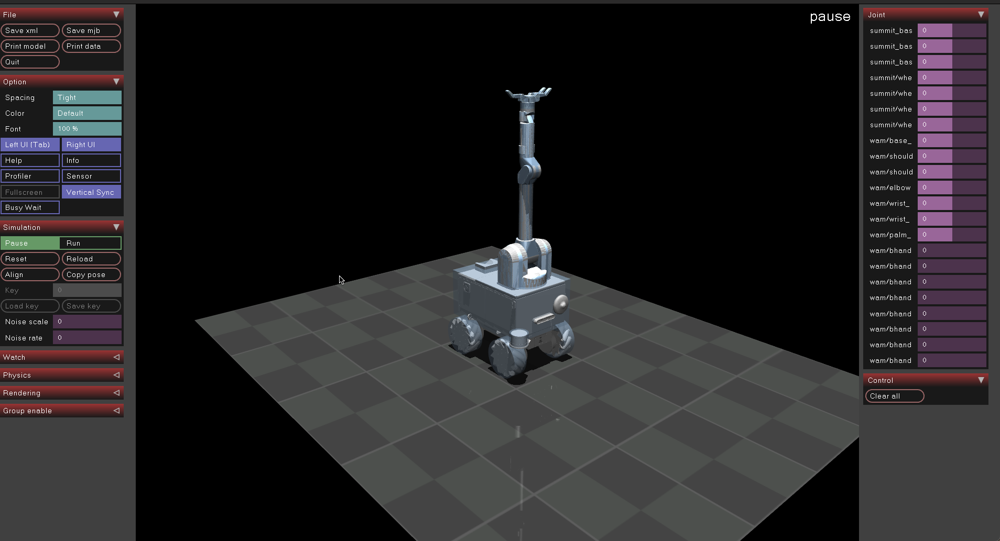
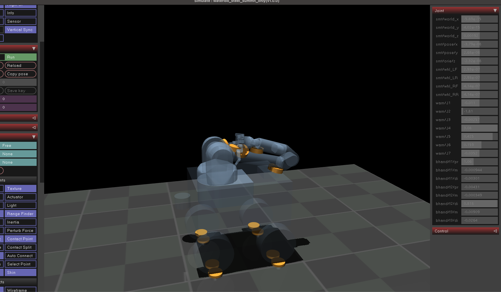
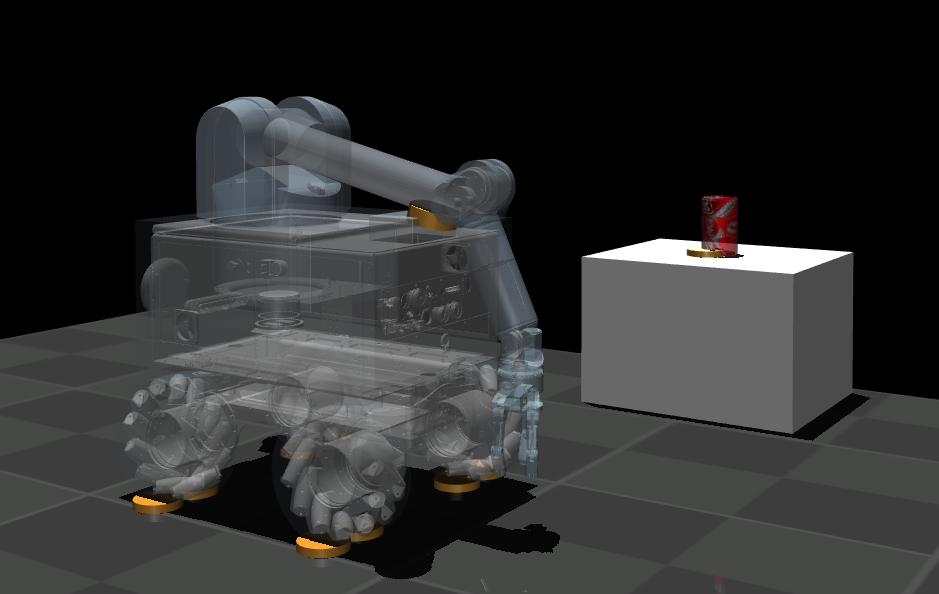
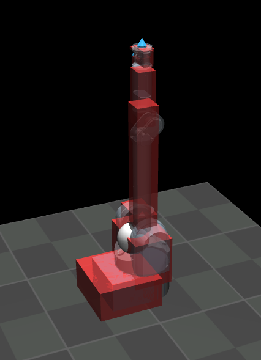

# simulation-mujoco-summit-wam
Mujoco Simulation Package for Waterloo steel robot

## Preview:
### Waterloo Steel Joint Preset Panel:

### Waterloo Steel Mobile Manipulator Simulation:

### Playground Demo:

### WAM 7DOF:
- WAM sim file is a CORRECTED and MODIFIED version based on [the official archived MuJoCo model made by Vikash kumar](https://roboti.us/forum/index.php?resources/wam-and-barrett-hand.20/)
    - Findings: The original model has collision disabled, and parameters are incorrectly populated
    - Note: We have modified the original model based on the given stl files completely, and configured MoI based on [the Official Barrett WAM Specification](https://web.barrett.com/support/WAM_Documentation/WAM_InertialSpecifications_AC-02.pdf). 
        - Specifically, we made exactly the same as described in the document, and removed incorrect quaternion parameters for `inertial` , and populated the `inertial` purely based on the centre of the mass and translated the coordinate frames to the stl model frame (manually)
- Shall you have any concern with the parameters, kindly open an issue.

## ToDo:
- [x] Full Assembly
- [x] Simulation setup
- [x] Contact Physics [Last Edit: 15/Jun/2022]
- [x] [WAM] Ensure Mechanical Params are Verified
- [ ] [BHAND] Ensure Mechanical Params are Verified
- [ ] [SUMMIT] Ensure Mechanical Params are Verified
- [ ] Control Descriptors
- [ ] Example Interfacing code
- [ ] ...